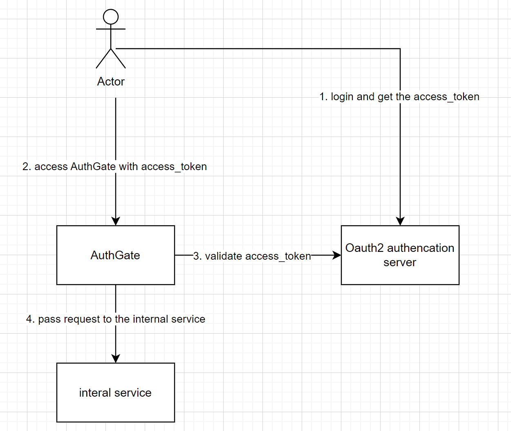
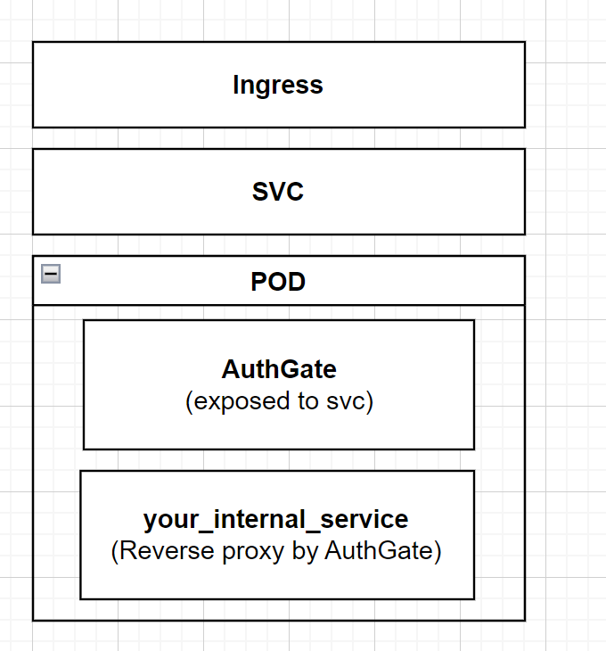

# AuthGate
AuthGate is a reverse proxy for your internal services. AuthGate provides authentication for your internal services that you want to expose to the public network.

# Mechanism (Oauth2 example)
For the most common use,you need an oauth2 authorization server. AuthGate tries to get `JWKS` from the oauth2 issuer url.(default path `/oauth2/jwks` and `/.well-known/openid-configuration` of the issuer). AuthGate plays a role of resource server in Oauth2.

AuthGate validate the jwt with the public key getting from the `JWKS`,passing the request to the internal service if the authentication ok.


# Features
1. Simple, clean, yet efficient code.
2. Easy to read and expand.
3. Easy to build and deploy,cloud native.
4. Supporting various signature algorithms.
   
    |Algorithm| 
    |-------| 
    |HS256|
    |HS384|
    |HS512| 
    |RS256|
    |RS384|
    |RS512|
    |ES256|
    |ES384|
    |ES256|
    |PS256|
    |PS384|
    |PS512|

# Why do I use AuthGate?
For `microservices`,services are developed by different teams, using different languages, based on different architectures, and even running on different platforms. Exposing numerous services to the public network and requiring authentication for access is quite challenging.AuthGate allows us to focus on developing the application itself, ignoring the technical details of authentication.

# k8s deployment example
You can deploy AuthGate and other applications into the same pod, hiding the applications, and allowing access to AuthGate only through Ingress and Service (svc).


# Quick start
## Build
```
git clone https://github.com/Heng-Bian/AuthGate
cd AuthGate/cmd
go build auth_gate.go
```
## Run
For help
```
./auth_gate -help
```
Start with Oauth2 issuer
```
./auth_gate -port 8080 -target YOUR_SERVICE_URL -issuer YOUR_ISSUER_URL
```
Start with base64 encoded secret(For HS signature)
```
./auth_gate -port 8080 -target YOUR_SERVICE_URL -secret YOUR_BASE64_SECRET
```
